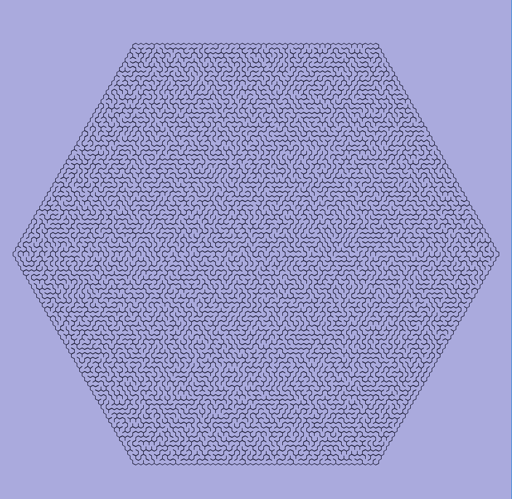
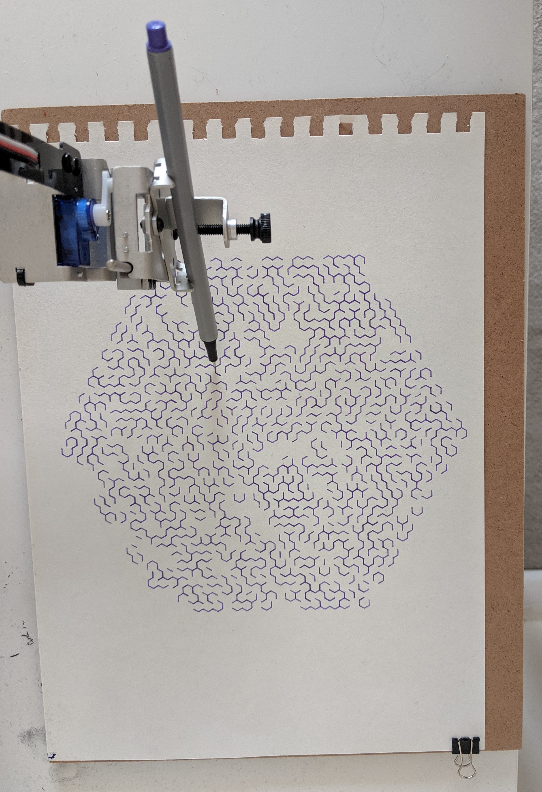

# Random hex maze generation
Generating a maze in a hex cell grid of certain size with simple DFS random traversal (limited by stack).

Reference for hex maze rendering: [Hexagonal Grids - From Red Blob Games](https://www.redblobgames.com/grids/hexagons/)

Result after running .PDE:

Being plotted:

