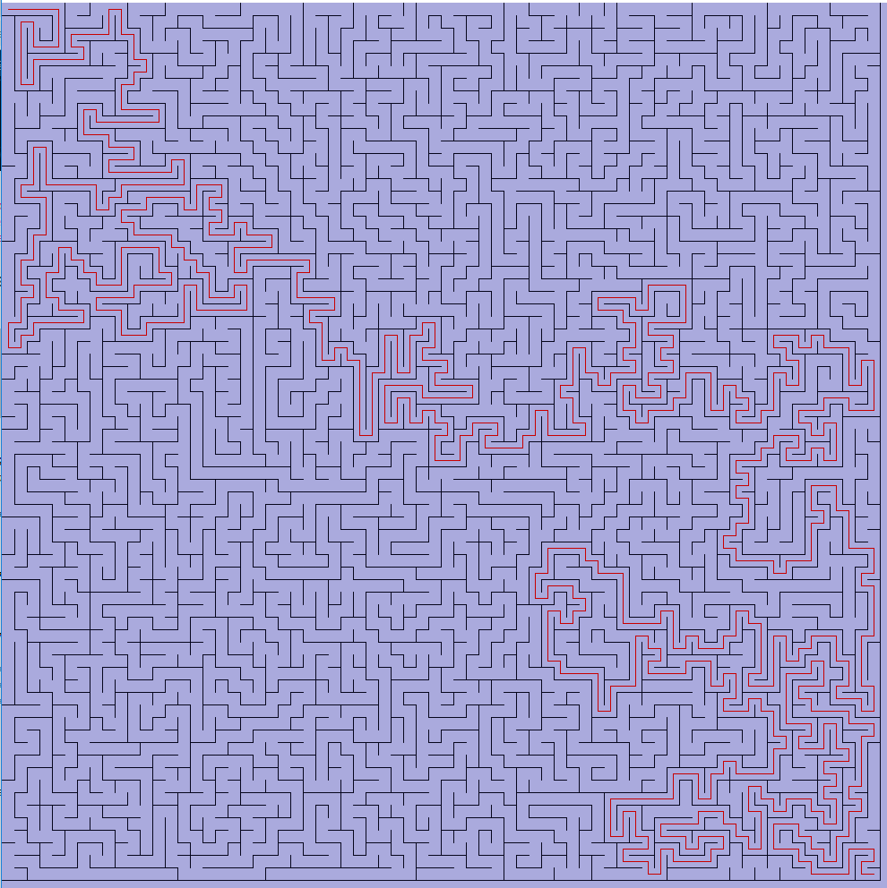

# Maze+path generation
Generating a maze in a square cell grid of certain size with simple DFS random traversal. Vizualize path from start to end as well.

Reference for algorithm: [The Buckblog - Maze generation: Recursive Backtracking](http://weblog.jamisbuck.org/2010/12/27/maze-generation-recursive-backtracking)

Result after running .PDE:

